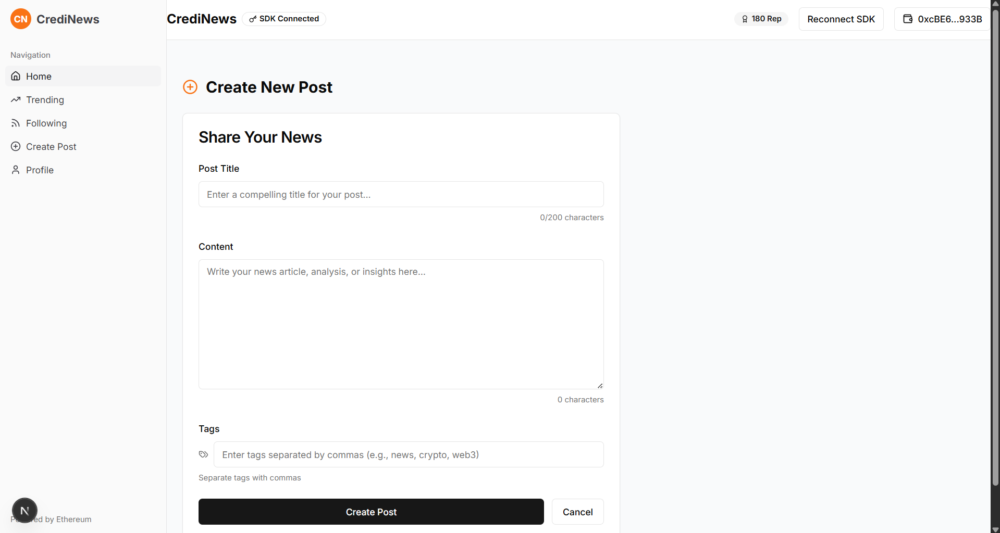
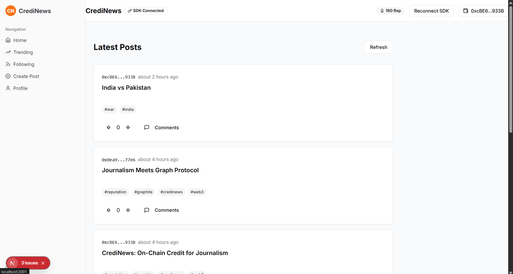
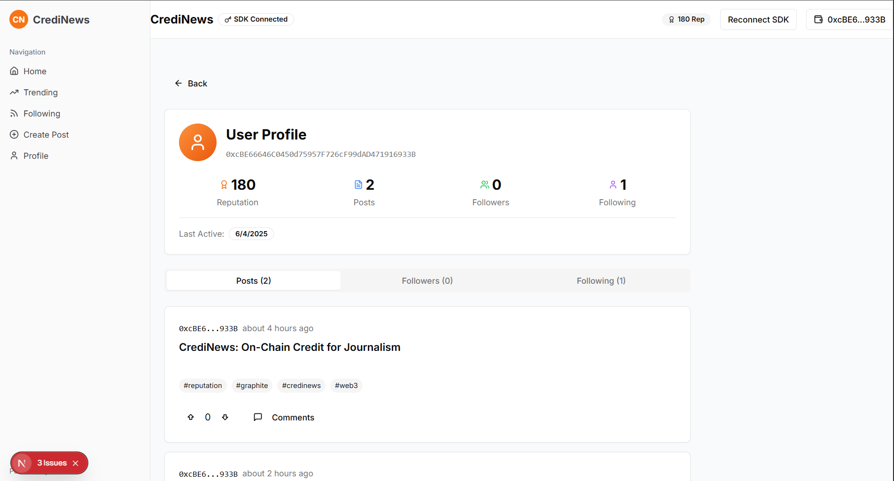

# 📰 CrediNews

CrediNews is a decentralized news publishing platform built on the [Graphite Network](https://graphite.xyz/), where reputation matters. It enables Sybil-resistant, cooldown-enforced, and identity-alternating content publishing using smart contracts and IPFS.

---

## 🌐 Live Demo

[🔗 Visit the Live App](https://credinews.vercel.app)  
[🎥 Watch Demo Video](https://youtu.be/YOUR_VIDEO_ID) _(replace this with your actual link)_

---

## 🧩 Problem Statement

In an era of misinformation and anonymous content spam, **CrediNews** aims to:

- **Prevent spamming** by enforcing a cooldown period between posts.
- **Deter Sybil attacks** by alternating wallet identities.
- **Ensure content permanence** using decentralized IPFS storage.
- **Anchor credibility** through on-chain, tamper-proof publishing.

---

## 🚀 Features

- ⏳ **Cooldown Posting**: One post allowed every 5 minutes per wallet.
- 🧑‍🤝‍🧑 **Identity Alternation**: Uses two unique wallets to alternate content authorship.
- 🧾 **On-chain Proof**: Each post is recorded on a smart contract deployed on Graphite.
- 📦 **IPFS Integration**: Content is stored using [Pinata](https://pinata.cloud) on IPFS.
- 🧠 **Reputation-first Design**: No AI hallucinations. Only real, verified content creators.

---

## 🤝 How Graphite Network Was Integral

The **Graphite Network** was a crucial foundation for CrediNews, enabling a trust-first, reputation-based decentralized news platform:

- **Sybil-Resistance & Reputation:**  
  Graphite’s reputation infrastructure helped enforce identity alternation and cooldowns, reducing spam and Sybil attacks on our smart contract.

- **Custom Chain Support:**  
  Deploying on Graphite Testnet (Chain ID: 54170) provided a performant and low-fee environment ideal for frequent post submissions.

- **Reliable RPC Endpoint:**  
  The dedicated Graphite RPC endpoints ensured smooth blockchain interactions for frontend and backend alike.

- **Developer-Friendly Tools:**  
  Using wagmi with Graphite’s custom chain support allowed seamless wallet connection (MetaMask) and contract calls, accelerating development.

- **Community & Ecosystem:**  
  Participation in the Graphite Network Hackathon gave us access to support, tools, and a vibrant ecosystem focused on decentralized reputation systems — perfectly aligned with CrediNews’ mission.

In essence, Graphite was not just a blockchain — it was the backbone that made a scalable, Sybil-resistant news publishing protocol possible.

---

## 📸 Screenshots

### 🖼️ 1. Home Page (Placeholder)



### 🖼️ 2. Trending Posts (Placeholder)



### 🖼️ 3. Profile View (Placeholder)



---

## ⚙️ Tech Stack

| Layer          | Technology                                                 |
| -------------- | ---------------------------------------------------------- |
| Smart Contract | Solidity + Hardhat                                         |
| Frontend       | Next.js + wagmi + viem                                     |
| Wallet Auth    | MetaMask via `wagmi/connectors`                            |
| Storage        | IPFS via Pinata SDK                                        |
| Chain          | [Graphite Testnet](https://graphite.xyz) (Chain ID: 54170) |
| Hosting        | Vercel (Frontend), IPFS (Posts)                            |

---

## 🛠️ How It Works

1. User uploads a `.json` news post (name, body, metadata).
2. JSON is pinned to IPFS via Pinata.
3. Smart contract enforces:
   - 5 min cooldown per wallet,
   - alternate wallet usage,
   - public on-chain logging.
4. Smart contract emits events and stores IPFS hash per post.

---

## 📁 Folder Structure

/credinews
├── contracts # Solidity smart contract
├── frontend # Next.js frontend
├── scripts # Posting automation scripts
├── posts # News posts in JSON format
├── public/screenshots # For README images
└── README.md # Project documentation

yaml
Copy
Edit

---

## 🧪 Local Setup

```bash
# 1. Clone the repo
git clone https://github.com/yourusername/credinews.git
cd credinews

# 2. Install dependencies
npm install

# 3. Set environment variables
cp .env.example .env

# 4. Run locally
npm run dev
🔐 Environment Variables
bash
Copy
Edit
# .env
RPC_URL=https://anon-entrypoint-test-1.atgraphite.com
PRIVATE_KEY1=0xabc...
PRIVATE_KEY2=0xdef...
PINATA_API_KEY=...
PINATA_SECRET_API_KEY=...
CONTRACT_ADDRESS=0x123...
📜 Smart Contract
File: CrediNews.sol

Main Function: createPost(string memory title, string memory ipfsHash)

Deployed To: Graphite Testnet

🧠 Authors
Raaghav Manivel (Frontend + Blockchain Integration)


📢 License
MIT © 2025 CrediNews
Built with ❤️ during the Graphite Network Hackathon
```
